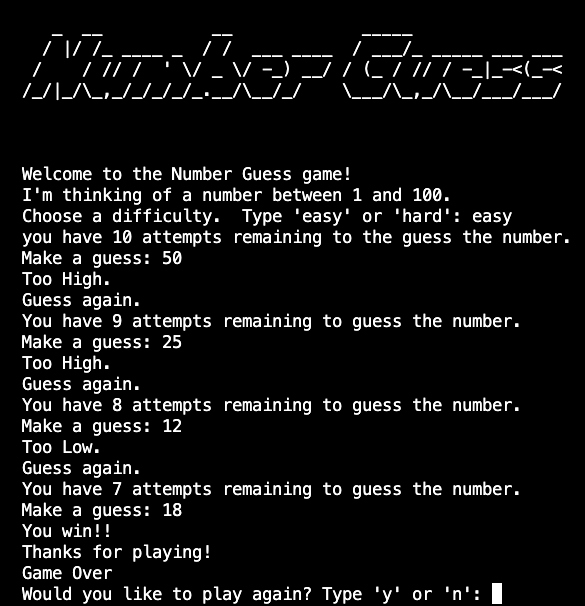

# Number Guess 

  ## Description

  A simple number guess game built using Python where computer selects a random number between 1 and 100 and user guesses the number. The user is prompted to select an 'easy' or 'hard' level, which determines the number of guesses a user is allowed.  After a guess is made, the game will respond whether the guess is too low or too high.
  
  Screenshot:

  

  ## Table of Contents
  
  - [Installation](#installation)
  - [Usage](#usage)
  - [License](#license)
  - [Contributing](#contributing)
  - [Tests](#tests)
  - [Questions](#questions)
  
  ## Installation
  
  run in terminal
  
  ## Usage
  
  follow user prompts

  ## License
This application is covered under the MIT License.
 For more information: https://opensource.org/licenses/MIT
  
  ## Contributing
  N/A
  
  ## Tests
  N/A

  ## Questions
  Contact Info 
  GitHub user name: BillStephens2022 
  Link to GitHub profile: https://github.com/BillStephens2022 
  Email: stephensbill17@gmail.com